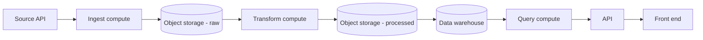
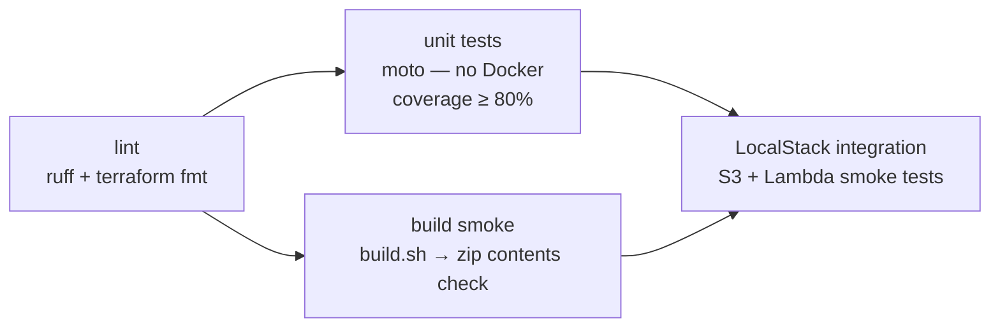

# Architecture

## Generic pattern



---

## AWS — Lambda + Glue + Redshift Spectrum

```mermaid
flowchart LR
    API[Open-Meteo API]

    subgraph Ingest ["Ingest  (hourly — EventBridge)"]
        LI[Lambda: ingest]
    end

    subgraph Lake ["Data Lake  (S3)"]
        RAW[(S3 raw/\nJSON)]
        PROC[(S3 processed/\nParquet)]
        SCRIPTS[(S3 scripts/\nGlue job)]
    end

    subgraph Catalog ["Glue Workflow  (crawl → ETL → crawl)"]
        CR[Glue Crawler\nraw]
        CAT_R[(Glue Catalog\nraw table)]
        ETL[Glue ETL Job\nSpark]
        CP[Glue Crawler\nprocessed]
        CAT_P[(Glue Catalog\nprocessed table)]
    end

    subgraph Warehouse ["Warehouse  (Redshift Serverless)"]
        RS[(Redshift Spectrum\nexternal schema)]
    end

    subgraph API_Layer ["API Layer"]
        LQ[Lambda: query\nRedshift Data API]
        APIGW[API Gateway\nHTTP API v2\nGET /latest]
    end

    subgraph Frontend ["Frontend  (S3 static website)"]
        FE[index.html\nURL injected by Terraform]
    end

    API -->|fetch weather JSON| LI
    LI -->|PUT JSON| RAW
    SCRIPTS -->|script source| ETL

    RAW --> CR
    CR --> CAT_R
    CAT_R --> ETL
    ETL -->|write Parquet| PROC
    PROC --> CP
    CP --> CAT_P

    CAT_P -->|external schema| RS
    RS -->|Data API| LQ
    LQ --> APIGW
    APIGW -->|JSON| FE
```



### Key design decisions

| Decision | Reason |
|---|---|
| Lambda for ingest, not Glue | Lambda is cheaper and simpler for a single small API call on a schedule |
| Glue Crawler → Catalog | Schema is inferred automatically from S3 — no DDL to maintain |
| Glue Workflow with `CONDITIONAL` triggers | Crawl raw → ETL → crawl processed are chained natively; Lambda doesn't need to know Glue exists |
| Redshift Spectrum (not COPY) | Parquet is queried directly from S3 via the Glue Catalog — no load step, no storage duplication |
| Redshift Data API (not JDBC) | The query Lambda needs no VPC, no driver, no connection pool — one IAM call |
| API Gateway HTTP API v2 | Lower cost and latency than REST API for a single `GET /latest` route |
| S3 static website | Zero-ops hosting; Terraform injects the real API Gateway URL at deploy time via `replace()` |

---

## Repository structure

```
aws-data-pipeline/
│
├── shared/                  # Pure-stdlib logic shared across cloud flavours
│   ├── ingest.py            #   fetch_data, to_raw_record, raw_object_key
│   └── transform.py         #   transform_record (raw dict → warehouse row)
│
├── lambda_ingest/           # Ingest Lambda
│   └── handler.py           #   fetch → S3 put
│
├── lambda_query/            # Query Lambda
│   └── handler.py           #   Redshift Data API → JSON response
│
├── glue/jobs/
│   └── transform_job.py     # Spark ETL (awsglue runtime only)
│
├── frontend/
│   └── index.html           # Dashboard — API URL placeholder replaced by Terraform
│
├── scripts/
│   └── mock_api.py          # Local mock server for frontend dev
│
├── terraform/
│   ├── main.tf              # S3, Lambda ingest, IAM
│   ├── query_lambda.tf      # Lambda query, IAM
│   ├── api_gateway.tf       # HTTP API v2
│   ├── frontend.tf          # S3 static website, URL injection
│   ├── variables.tf
│   ├── outputs.tf           # Includes spectrum_schema_sql convenience output
│   └── providers.tf
│
├── tests/
│   ├── unit/                # moto-backed, no Docker (pytest -m unit)
│   ├── integration/         # LocalStack S3 (pytest -m integration)
│   └── smoke/               # Critical-path end-to-end (pytest -m smoke)
│
├── .github/workflows/ci.yml # lint → unit+coverage → build-smoke → LocalStack integration
├── docker-compose.localstack.yml
├── build.sh                 # Packages lambda_ingest/ and lambda_query/ into zips
└── pyproject.toml           # uv deps, ruff config, pytest markers
```

---

## CI pipeline


