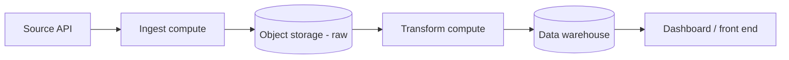
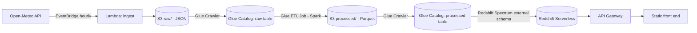

# Architecture

## Generic pattern

## AWS — Lambda + Glue + Redshift Spectrum

The dotted line from raw crawl -> transform job -> processed crawl is a
single Glue Workflow (`aws_glue_workflow.pipeline`), chained with
`CONDITIONAL` triggers — Glue handles that orchestration natively, so Lambda
and Glue stay decoupled (Lambda doesn't need to know Glue exists, and vice
versa).
